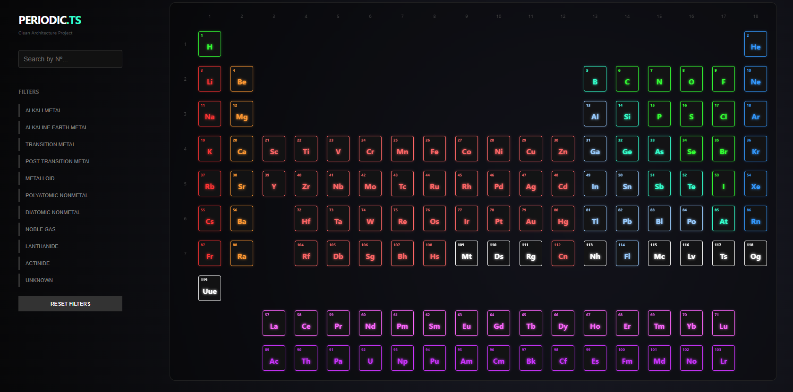

# ⚛️ Periodic.ts | Enterprise Clean Architecture


> A highly interactive, neon-styled Periodic Table built to demonstrate **Clean Architecture**, **SOLID Principles**, and **Strict Dependency Injection** in a modern Frontend ecosystem.



---

## 🚀 Overview

This project is not just a periodic table visualization; it is an architectural study. The main goal was to move away from the standard "monolithic component" approach often found in React and instead implement a robust, scalable, and testable **Enterprise-grade Architecture**.

---

## ✨ Key Features

* **🧪 Interactive Bohr Model:** A pure CSS/React component that renders electrons orbiting the nucleus based on the real atomic number configuration.
* **🎨 Neon Cyberpunk Aesthetic:** Custom glassmorphism UI, radial gradients, and advanced CSS effects.
* **📐 CSS Grid Layout:** Mathematical positioning of elements using Cartesian coordinates (`xpos`, `ypos`) mapped from the domain data.

* **🔍 Advanced Filtering:**
    * Filter by **Group** (Vertical Columns).
    * Filter by **Period** (Horizontal Rows).
    * Filter by **Chemical Family** (Alkali, Noble Gases, etc.).
    * Instant Search by **Atomic Number**.

---

## 🏗️ Architecture & Design Patterns

The codebase follows the **Clean Architecture** concentric layers, ensuring that the *Domain* knows nothing about the *UI*, and the *Data* layer is just a pluggable detail.

### The Layers structure

```text
src/
├── domain/              # 🧠 Enterprise Rules (The Core)
│   ├── entities/        # Pure TypeScript Interfaces (Element)
│   └── enums/           # Value Objects (Category, Phase)
│
├── application/         # 💼 Business Logic
│   ├── contracts/       # Repository Interfaces (Ports)
│   ├── useCases/        # Single Responsibility Actions (e.g., GetAllElements)
│   └── services/        # ElementFacade (Orchestrator)
│
├── infrastructure/      # 🔌 Adapters & Drivers
│   ├── dtos/            # Data Transfer Objects (Raw API shape)
│   ├── mappers/         # Data Transformers (DTO -> Entity)
│   └── repositories/    # Concrete Implementation (Fetch API)
│
├── ioc/                 # 💉 Inversion of Control
│   ├── container.ts     # DI Container Configuration
│   └── types.ts         # Symbol Identifiers (Tokens)
│
└── presentation/        # 🎨 UI & Frameworks
    ├── components/      # Dumb Components (AtomModel, ElementCard)
    ├── hooks/           # ViewModels (MVVM Pattern)
    └── context/         # DI Provider (React Context Bridge)
Patterns Implemented
Dependency Injection (DI): Using InversifyJS and reflect-metadata to inject dependencies via constructors using Symbols as tokens.

Repository Pattern: To abstract the data source. The application doesn't know if data comes from a JSON, a REST API, or GraphQL.

Adapter Pattern: Using Mappers to transform "dirty" DTOs into clean Domain Entities.

Facade Pattern: An ElementFacade service that simplifies the interaction between the UI and multiple Use Cases.

MVVM (Model-View-ViewModel): Custom Hooks (usePeriodicTable) act as ViewModels, exposing state and commands to the View (Components), keeping the UI logic-free.

🧩 Code Snippet: The Dependency Injection
Here is how we decouple the application using InversifyJS. The UI requests a symbol, not a concrete class.

1. The Container Configuration (IoC):

TypeScript

// Binding Interfaces (via Symbols) to Concrete Implementations
container.bind<ElementMapper>(TYPES.ElementMapper).to(ElementMapperImp);
container.bind<ElementRepository>(TYPES.ElementRepository).to(ElementRepositoryImp);

// Binding the Facade
container.bind<ElementFacade>(TYPES.ElementFacade).to(ElementFacade);
2. The ViewModel (Consumption):

TypeScript

export const usePeriodicTable = () => {
  // The UI doesn't know about Repositories or implementations.
  // It just asks for the Facade via the Token.
  const facade = useInjection<ElementFacade>(TYPES.ElementFacade);

  useEffect(() => {
    facade.getAllElements().then(setElements);
  }, []);
};

